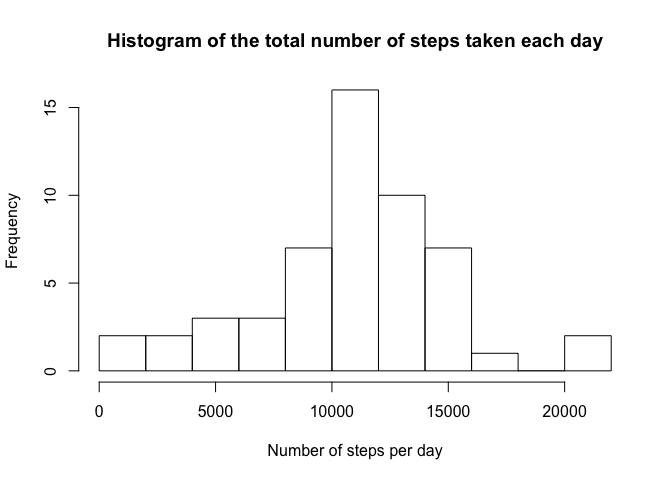
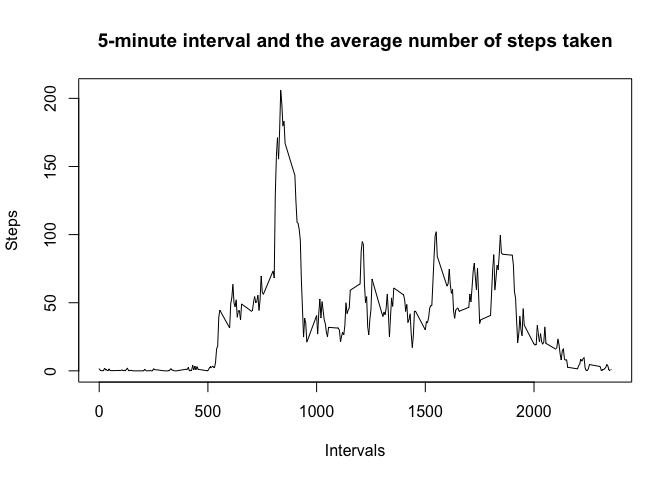
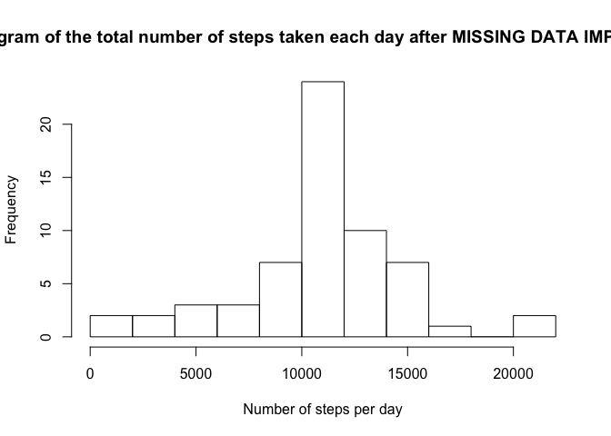
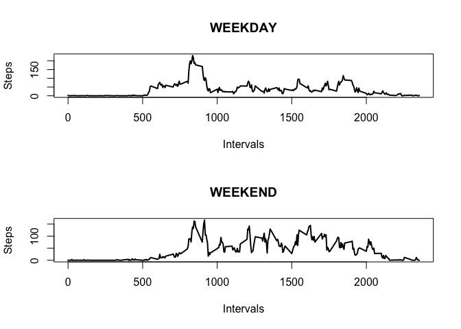

# Course Project 1 - Reproducible Research
Matheus Nogueira  
8/28/2017  


#Loading and preprocessing the data

This is the code to load the data.

```r
data <- read.csv("activity.csv")
summary(data)
```

```
##      steps                date          interval     
##  Min.   :  0.00   2012-10-01:  288   Min.   :   0.0  
##  1st Qu.:  0.00   2012-10-02:  288   1st Qu.: 588.8  
##  Median :  0.00   2012-10-03:  288   Median :1177.5  
##  Mean   : 37.38   2012-10-04:  288   Mean   :1177.5  
##  3rd Qu.: 12.00   2012-10-05:  288   3rd Qu.:1766.2  
##  Max.   :806.00   2012-10-06:  288   Max.   :2355.0  
##  NA's   :2304     (Other)   :15840
```

#What is mean total number of steps taken per day?

Now, let's take a look at the number of steps taken per day with dplyr:


```r
library(dplyr)
steps_per_day <- data %>% group_by(date) %>% summarise(steps=sum(steps))
```

The histogram of the total number of steps taken each day.


```r
hist(steps_per_day$steps,main = "Histogram of the total number of steps taken each day",xlab = "Number of steps per day", breaks = 10)
```

<!-- -->

Calculating mean and median of total number of steps taken each day.


```r
mean_SPD <- round(mean(steps_per_day$steps[!is.na(steps_per_day$steps)]),digits = 2)
median_SPD <- round(median(steps_per_day$steps[!is.na(steps_per_day$steps)]),digits = 2)

mean_SPD
```

```
## [1] 10766.19
```

```r
median_SPD
```

```
## [1] 10765
```

The mean of steps taken per day is 1.076619\times 10^{4} and the median is 1.0765\times 10^{4} 

#What is the average daily activity pattern?

Now, let's change the paradigma and take a look at the daily activity patern.
First, we calculate the average number of steps taken, averaged across all days.


```r
steps_per_intervals <- data[!is.na(data$steps),] %>% group_by(interval) %>% summarise(steps=mean(steps))
```

This is the plot 5-minute interval Vs average number of steps taken


```r
plot(steps_per_intervals$interval,steps_per_intervals$steps,type = "l",xlab="Intervals",ylab="Steps",main="5-minute interval and the average number of steps taken")
```

<!-- -->


```r
maxIntervalSteps <- steps_per_intervals$interval[which.max(steps_per_intervals$steps)]
maxIntervalSteps
```

```
## [1] 835
```

The 5-minute interval, on average across all the days in the dataset, that contains the maximum number of steps is 835.

#Imputing missing values


```r
NumberOfNAs <- nrow(data[is.na(data[,1]),])
NumberOfNAs
```

```
## [1] 2304
```

The number of NA observations is 2304.

The strategy for imputing missing values is the mean of the interval.


```r
new_data <- data

for (i in which(is.na(data$steps)==TRUE)) {
        interval <- data$interval[i]
        new_data$steps[i] <- steps_per_intervals$steps[which(steps_per_intervals$interval==interval)]
}
```

Histogram, mean e median of total number of steps taken per day AFTER MISSING DATA IMPUTATION.


```r
new_steps_per_day <- new_data %>% group_by(date) %>% summarise(steps=sum(steps))
```

The histogram of the total number of steps taken each day AFTER MISSING DATA IMPUTATION.

```r
hist(new_steps_per_day$steps,main = "Histogram of the total number of steps taken each day after MISSING DATA IMPUTATION",xlab = "Number of steps per day", breaks = 10)
```

<!-- -->


```r
new_mean_SPD <- round(mean(new_steps_per_day$steps),digits = 2)
new_median_SPD <- round(median(new_steps_per_day$steps),digits = 2)

new_mean_SPD
```

```
## [1] 10766.19
```

```r
new_median_SPD
```

```
## [1] 10766.19
```

The mean of steps taken per day after missing data imputation is 1.076619\times 10^{4} and the median is 1.076619\times 10^{4}. **We see that only the median is different from the first part of this report.**

#Are there differences in activity patterns between weekdays and weekends?

Creating the variable weekday/weekend:


```r
dayweek <- weekdays(as.Date(new_data[,2]))
sat <- which(dayweek=="Saturday")
sun <- which(dayweek=="Sunday")

weekend <- union(sat,sun)
weekday_weekend <- rep("weekday",nrow(new_data))
weekday_weekend[weekend] <- "weekend"

new_data$weekday_weekend <- weekday_weekend
```

Time series plot for weekday and weekend:


```r
intervals <- levels(as.factor(new_data[,3]))
spi_weekday <- rep(0,length(intervals))
spi_weekend <- rep(0,length(intervals))

data_weekday <- new_data[which(new_data[,4]=="weekday"),]
data_weekend <- new_data[which(new_data[,4]=="weekend"),]

for (i in 1:length(intervals)) {
        spi_weekday[i] <- mean(data_weekday[which(data_weekday[,3]==intervals[i]),1])
        spi_weekend[i] <- mean(data_weekend[which(data_weekend[,3]==intervals[i]),1])
}
```


```r
par(mfrow=c(2,1))
plot(intervals,spi_weekday,type="l",main = "WEEKDAY",xlab="Intervals",ylab="Steps",lwd=2)
plot(intervals,spi_weekend,type="l",main = "WEEKEND",xlab="Intervals",ylab="Steps",lwd=2)
```

<!-- -->


knit2html()
